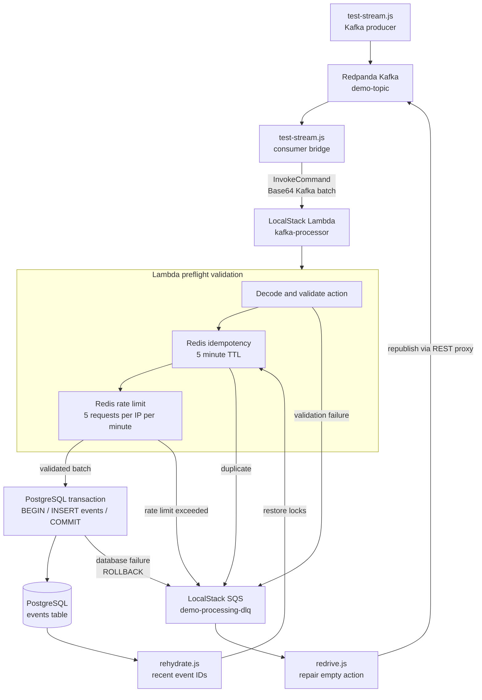

```mermaid
flowchart
    Producer["test-stream.js\nKafka producer"] --> Kafka["Redpanda Kafka\ndemo-topic"]
    Kafka --> Consumer["test-stream.js\nconsumer bridge"]
    Consumer -->|"InvokeCommand\nBase64 Kafka batch"| Lambda["LocalStack Lambda\nkafka-processor"]

    subgraph Validation["Lambda preflight validation"]
        Parse["Decode and validate action"] --> Idempotency["Redis idempotency\n5 minute TTL"]
        Idempotency --> RateLimit["Redis rate limit\n5 requests per IP per minute"]
    end

    Lambda --> Validation
    RateLimit -->|"validated batch"| Transaction["PostgreSQL transaction\nBEGIN / INSERT events / COMMIT"]
    Transaction --> Events[("PostgreSQL\nevents table")]

    Parse -->|"validation failure"| DLQ["LocalStack SQS\ndemo-processing-dlq"]
    Idempotency -->|"duplicate"| DLQ
    RateLimit -->|"rate limit exceeded"| DLQ
    Transaction -->|"database failure\nROLLBACK"| DLQ

    DLQ --> Redrive["redrive.js\nrepair empty action"]
    Redrive -->|"republish via REST proxy"| Kafka
    Events --> Rehydrate["rehydrate.js\nrecent event IDs"]
    Rehydrate -->|"restore locks"| Idempotency
```
